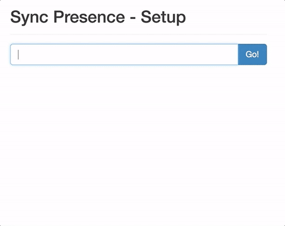
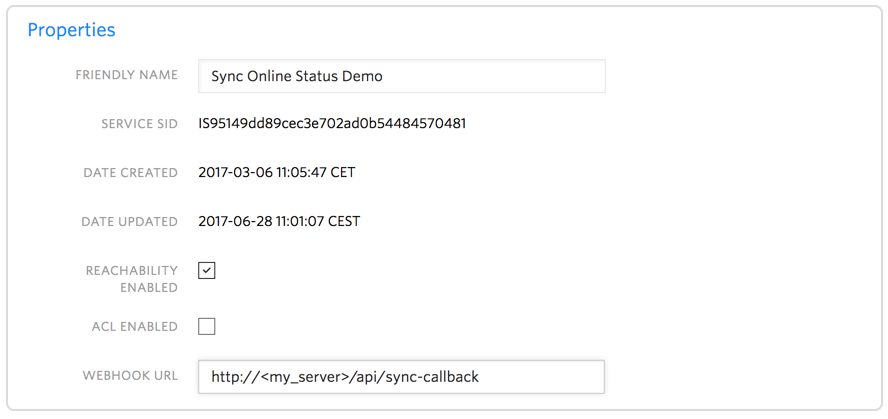
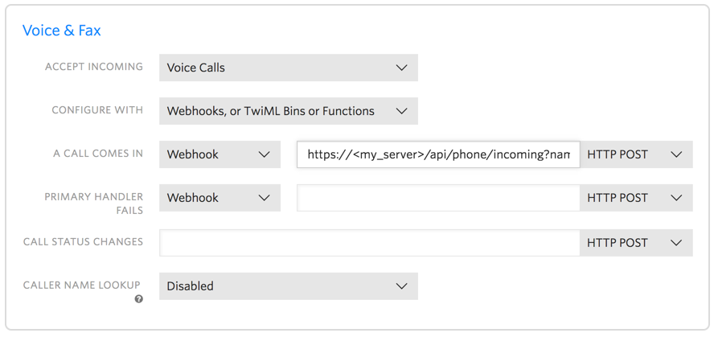

# Twilio Sync Online Status with a WebRTC Phone

A user online status demo built with Twilio Sync and Twilio Client. The demo utilizes Twilio Sync - a real-time state synchronization engine - to keep the server in sync with with the online presents of the users on a browser. This synchronized state enables us to control incoming phone calls to a Twilio number. If the user is online the caller is connected to the Twilio Client WebRTC phone via TwiML. In the case that the user is offline the server returns a TwiML response to the caller with a text-to-speech message the user it not available right now.



## Install - On Your Own Server or Machine

This project requires [Node.js](http://nodejs.org/) 6 or greater.

### Twilio Setup

Open https://www.twilio.com/console/sync/services and create a new Service. 

**Important**
Please mark the reachability checkbox, with this setting enabled, Twilio will later request the webhook and update us if a new user establishes a WebSocket connection an is available.



Set the Sync Service webhook Url to `http://<your_application_domain>/api/sync-callback` Twilio will request this address if the reachabilty of an endpoint changes.

### Install Dependencies

Navigate to the project directory in your terminal and run:

```bash
npm install
```
In order to run the demo you will need to set the following environment variables:

- `TWILIO_ACCOUNT_SID`
- `TWILIO_AUTH_TOKEN`

... and for Twilio Sync

- `TWILIO_SYNC_SERVICE_SID` - the Sync Service Sid created before
- `TWILIO_SYNC_DOCUMENT` - a document name to store our user database, for example `user_status_db`

Start the application

`node app.js`

After the server is started open `https://<your_application_name>` in your browser. You are now asked to input any user name. After you entered the username and pressed "go", the demo will do the following things.

### Server
* The user name is stored in a local JSON file __configuration.json__
* This __configuration.json__ is synced to Twilio Sync with the document name __TWILIO_SYNC_DOCUMENT__
* The server issues a token for Twilio Sync and Twilio Client

#### Client (Browser)
* Connects to Twilio Sync and listens to all updates on the __TWILIO_SYNC_DOCUMENT__ document.
* Connects to Twilio Client and is waiting for incoming calls

#### What's next

Configure a Twilio number for inbound calls. Point the webhook to `https://<your_application_name>/api/phone/incoming` and add the username you want to call as a GET parameter; example `https://<your_application_name>/api/phone/incoming?name=alice`



Now call the Twilio number, if the called user is online on at least one endpoint the TwiML document will redirect the call to the user's browser, else the alternative TwiML is played.  

**Note:** 

Please create a separate sub-account within Twilio and install this app using that sub-account credentials.

On Google Chrome a secure HTTPS connection is required to do phone calls via WebRTC. Use a tunnel that supports HTTPS such as ngrok, which can forward the traffic to your webserver.

## Questions?

Message [mdamm@twilio.com](mailto:mdamm@twilio.com) 

## License

MIT
	
## Contributors
	
- Matthias Damm <mdamm@twilio.com>
